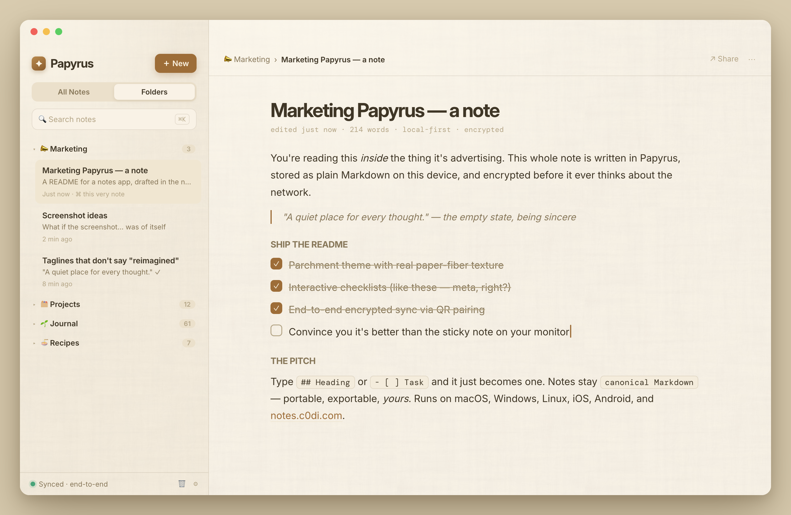

<div align="center">

# ✦ Papyrus

### A quiet place for every thought.

**Local-first Markdown notes that stay private, portable, and yours.**
Runs everywhere. Syncs end-to-end encrypted. Never waits on the network.

[](https://tauri.app)
[](https://react.dev)
[](https://sqlite.org)
[](#-your-notes-your-keys-nobody-elses-business)
[](https://notes.c0di.com)



<sub>Yes, that screenshot is a note in Papyrus, about marketing Papyrus, written in Papyrus. We're aware. It's fine.</sub>

</div>

---

## The pitch (which the app also wrote about itself)

Most notes apps want to become your operating system. Papyrus just wants to hold your thoughts and then get out of the way.

It's a **paper-first** Markdown notebook. You type `## Heading` or `- [ ] Task` and it quietly becomes one — no toolbars to hunt, no blocks to summon. Every note is canonical Markdown living in a **local SQLite database on your own device**, so editing is instant, search is instant, and nothing you write is ever hostage to a spinner.

When you *want* your notes on another device, sync is **end-to-end encrypted** and pairs with a QR code. The relay that shuttles your data between devices is deliberately, structurally clueless — it sees ciphertext and routing IDs and nothing else. Not your note titles. Not your folder names. Not a thing.

> *"A quiet place for every thought."* — the empty state, being completely sincere

---

## ✦ What's in the box

- **📝 Paper-first editor** — WYSIWYG feel, canonical Markdown underneath. Right-click for headings, lists, checklists, links, code, and images. There's a raw-source CodeMirror escape hatch for when you want to see the machinery.
- **☑️ Checklists that actually behave** — `- [ ]` toggles, continues on Enter, and the caret lands exactly where you'd expect. (This sounds trivial. It was not trivial.)
- **⚡ Markdown shortcuts** — `## `, `- `, `1. `, `- [ ] ` auto-promote as you type.
- **🗂️ Folders that make sense** — expandable tree, drag-and-drop notes between folders, reorder, rename, per-folder counts.
- **🔍 Instant full-text search** — SQLite FTS, recency sorting, `⌘K` to jump, `⌘N` for a fresh page.
- **🖼️ Inline images** — PNG, JPEG, GIF, WebP up to 4 MB, embedded as portable data URLs. Your Markdown stays a single self-contained file.
- **📦 Whole-notebook export** — one ZIP, organized by folder, readable Markdown with YAML metadata. Your notes can always walk out the front door.
- **🗑️ 30-day Trash** — restore, permanent delete, or empty. Mistakes get a grace period.
- **🎨 7 themes, 3 fonts** — Papyrus (warm parchment with real paper-fiber grain), Mist, Graphite, Nord, Solarized, Dracula, Gruvbox.
- **🔐 End-to-end encrypted sync** — QR pairing, immutable revisions, conflict review that *never overwrites* (Keep Current / Keep Other / Keep Both), device revocation.
- **📴 Offline-first, always** — autosave, background sync every couple minutes and on focus, but editing never once waits for a network round-trip.
- **📱 Genuinely cross-platform** — macOS, Windows, Linux, **native iOS and Android**, plus the web at [notes.c0di.com](https://notes.c0di.com).

---

## 🔒 Your notes, your keys, nobody else's business

Papyrus is local-first by conviction, not marketing.

- Every device keeps a **complete SQLite copy** of your notebook. The app is fully functional with the Wi-Fi off.
- Notes are encrypted on-device with **XChaCha20-Poly1305**, signed with **Ed25519**, before anything touches the wire.
- Pairing a new device does an **X25519** key exchange seeded by the QR secret, runs it through **HKDF-SHA256**, and hands the vault key straight from device to device. The relay is never in the loop.
- Private keys live in your **OS keychain**; secrets are zeroized in memory after use.
- The [sync relay](relay/README.md) is a Cloudflare Worker that stores only opaque IDs, ciphertext, acknowledgements, and expiry times. It is a very well-paid mail carrier that cannot read the mail.

Even if you never turn sync on, Markdown export is always there. Papyrus is designed to be leaveable — which, paradoxically, is why you'll stay.

---

## 🛠️ Built with

| Layer | Tech |
|---|---|
| Shell | **Tauri 2** (Rust + system webview) — desktop *and* mobile |
| Frontend | **React 19** · TypeScript · Vite 6 |
| Editors | Custom paper WYSIWYG · **CodeMirror 6** · markdown-it |
| Storage | **SQLite** (bundled, via rusqlite) with FTS |
| Crypto | XChaCha20-Poly1305 · Ed25519 · X25519 · HKDF-SHA256 |
| Sync relay | **Cloudflare Workers** + D1 + R2 |
| Web | Static React build on Cloudflare → `notes.c0di.com` |

---

## 🚀 Run it

```sh
npm install
npm run tauri dev
```

For local sync development, start the relay in another terminal:

```sh
cd relay
npm install
npx wrangler d1 migrations apply papyrus-sync-relay --local
npm run dev
```

Package a native macOS app:

```sh
npx tauri build --bundles app
# → src-tauri/target/release/bundle/macos/Papyrus.app
```

See [`relay/README.md`](relay/README.md) for failure simulation, testing, and deployment of the sync relay.

---

<div align="center">

**Papyrus** — write it down, keep it yours.

<sub>This README was drafted in a notes app, about a notes app, and the last checkbox on its to-do list is still unchecked until you clone it.</sub>

</div>
